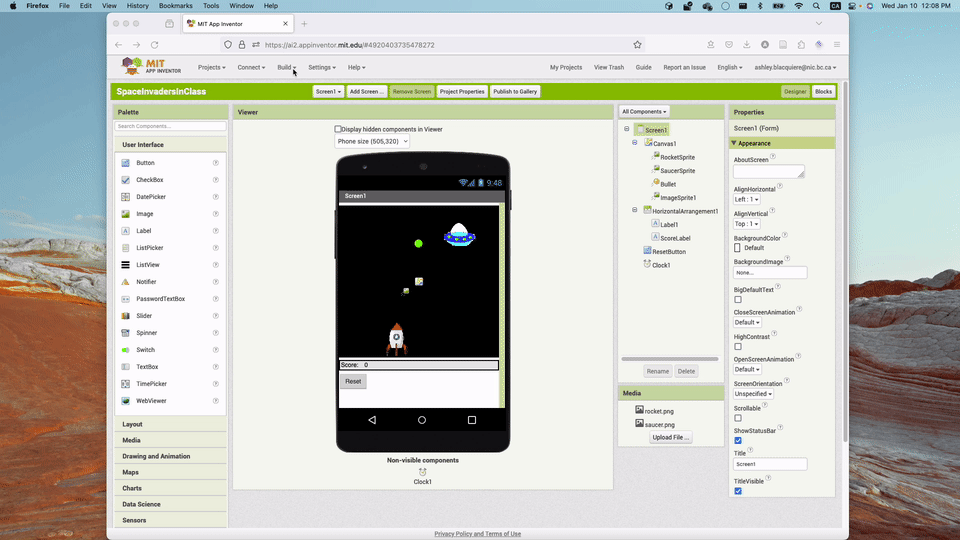

# WEEK 1 (WEEK OF May 5)
## LECTURE - PLATFORMS & MIT APP INVENTOR

> Primary contributor: **[Ashley Blacquiere](https://ca.linkedin.com/in/ashley-blacquiere)**
>
> Modified by: Dibya Prokash Sarkar

### WHAT IS A "PLATFORM," REALLY?

The full title of DGL 104 is *Application Development Foundations*, and the official course description promises that you'll "gain experience in modern development, testing, and profiling tools for **platform-based** applications."

It's worth pausing on that phrase: **platform-based**. The word is doing real work.

Most of the programs you've written so far in your degree have been **general-purpose**: a Python script that prints prime numbers, a C++ program that sorts a list, a Java assignment that calculates statistics. These programs care about *logic*. They don't particularly care about *where* they run.

Platform-based development is different. The **place** your code runs becomes a first-class design concern. A web app lives in the browser, talks to a DOM, and dies when you close the tab. A mobile app lives on a device that can be killed by the OS at any time, has a camera, has GPS, and must respect notification permissions. An edge function lives on someone else's server, runs for milliseconds, and may not even share memory with its previous invocation.

Same logic — say, "count button clicks" — looks completely different on each of these. That's what "platform-based" means.

> **The point of this course** is to build good design and engineering practice that holds up no matter the platform, while also developing your sensitivity to what each platform demands. The skills transfer; the surface details don't.

It's worth saying explicitly: this course does **not** define which specific platform you'll deploy to in your career. Some of you will end up writing iOS apps in Swift. Others will write React websites, or Kotlin Android apps, or backend Go services, or firmware in C. The tools change. The *thinking* we'll practice this term applies to all of them.

### WHY YOU LEARN MULTIPLE PLATFORMS

A reasonable question: "If I just want to build mobile apps, why do I need to think about edge functions or web platforms?"

There are four honest reasons:

### Reason 1 — The patterns are universal

Separation of concerns. MVC. Dependency injection. Testability. Coupling and cohesion. These design principles emerged from decades of pain across **every** platform. Once you understand them in one context, you'll recognize the same patterns in iOS development, in Android, in Unity game development, in backend services, even in firmware.

The platforms change. The patterns don't.

### Reason 2 — Most real apps span platforms

Open Spotify on your phone right now. That app has a **mobile** front-end (likely Swift or Kotlin). It talks to **edge** APIs (perhaps on Cloudflare or AWS) that authenticate you. Those APIs talk to a **backend service** (probably Java or Go) that streams audio. There's a **web** version of Spotify too, and a **desktop** Electron app. *Five platforms in one product.*

If your career involves working on any non-trivial software, you will almost certainly have to reason about platforms you don't personally write code for. A mobile dev who can't read a backend API spec is a partial mobile dev. A backend dev who has no idea what a _useState_ hook is will struggle to debug the system holistically.

### Reason 3 — Platforms have tradeoffs you must consciously choose

Should this app be a website or a native iOS app? A Progressive Web App or React Native? An Electron desktop app or native Mac/Windows builds? These aren't trivia questions — they shape **user experience, cost, team size, update speed, and what's even possible**.

Engineers who can articulate these tradeoffs lead projects. Engineers who can't, follow.

### Reason 4 — The job market rewards platform fluency

In 2026, "I only know Android" is a smaller market than "I know Android, and I can also reason about how the backend it talks to works." Every platform you understand at a conceptual level expands the kinds of projects you can usefully contribute to and the conversations you can usefully participate in.

This isn't an argument for being a generalist who knows nothing deeply. It's an argument for having one or two areas of real expertise and enough breadth to understand how those areas connect to everything else.

### THE PLATFORM LANDSCAPE IN 2026

Here's a quick map of the major categories. We'll touch some of these directly this term, others only conceptually.

| Platform | Examples you've used | Common stacks | Hallmark |
| -------- | -------- | -------- | -------- |
| Web | Gmail, Figma, Notion, Brightspace | JS/TS, React, Vue, Svelte | URL = installation |
| Mobile | Instagram, Uber, banking apps | Swift (iOS), Kotlin (Android), React Native, Flutter | Deep hardware access |
| Desktop | VS Code, Slack, Spotify | Electron, Tauri, native C# / Swift | Long sessions, full filesystem |
| Edge / serverless | Backend APIs, auth flows | Node, Go, Rust, Python; Cloudflare Workers, AWS Lambda | Scales 0 → ∞ |
| Embedded / IoT | Smart thermostats, fitness trackers | C, C++, Rust, MicroPython | Constrained resources |
| AR / VR | Vision Pro, Meta Quest | Swift, Unity, Unreal | New interaction models |

Each row is a different "stage" your code performs on. Each stage has its own conventions, its own audience, and its own physics.

You won't become an expert in any single one of these in a 13-week course. The goal is **fluency** — being able to read code on any of these platforms and recognize the design decisions, tradeoffs, and anti-patterns at play.

### A NOTE ON THIS TERM'S TOOLS

We'll spend a separate slide deck and lecture going through the specific tools we'll use this term — what we picked, why we picked it, and what alternatives exist. The short version: we anchor in **one** platform deeply, use it to ground all the architectural lessons, and reach back out to the broader landscape in our case studies and discussions. The tools may be different — and that's by design. The tooling story has moved on, and we're moving with it.

### MIT APP INVENTOR
[MIT App Inventor](https://appinventor.mit.edu) (officially, "MIT App Inventor 2", so I'll refer to it as `AI2` from now on) is a web-based mobile app development and block code editing tool that can be used to develop fairly complex mobile apps. `AI2` is intended to help "democratize" the process of development - meaning it puts the tools necessary for app development in reach of the average individual: Many people with no prior coding experience have successfully used `AI2` to create some [pretty amazing apps](https://appinventor.mit.edu/about-us).

As DGL 104 students you already have programming expertise, so learning the basics `AI2` will be easy - and this is precisely why we'll be using it. Since many of you are just learning about Android development this semester in DGL 114, it would be unreasonable to ask you to start building native Android apps as part of this course; instead, we'll use `AI2` to ensure that we have a way to rapidly prototype and test apps and app designs so that we can better understand the conditions of development.

The following video provides a brief introduction to `AI2`, with more detailed step-by-step tutorial below. Don't worry about following along with this video - just watch to get an overview of the interface.

<iframe width="560" height="315" src="https://youtube.com/embed/eSvtXWpZ6os"></iframe>

## ACTIVITIES
> **First class note**: The activities section for each week will contain _required_ activities that I expect you complete _before_ the following week's class. E.g., Week 1 activities should be completed _before_ Week 2.
>
> Activities marked as _recommended_ should also be completed before the following week's class, if you choose to complete them. Recommended activities can be skipped, but are generally worth doing, if you have the time. 

### [RECOMMENDED] WRITE A DAILY JOURNAL ENTRY
> This activity and similar journaling and reflective activities are recommended during the first half of the semester. In the second half of the semester they will be _required_. Take time to try these out now!

Keeping a daily journal of your goals and activities is a great way to scaffold your learning: When you record the tasks that you've spent time on and intentionally reflect on them you are more likely to build on what you've learned, rather than continually reinventing the wheel.

It's good practice to use a daily journal to keep track of all your work, but if that feels like too much you can concentrate exclusively on DGL 104. Each day you work on DGL 104 - wether it's watching/reading, or completing activities, or both, spend some time with your journal before and after.

For now, I recommend keeping it simple:
- Choose a tool that is easy for you to commit to: You can write in a paper journal/notepad, or you can start a Word document or a Google Docs document, or whatever works for you.
- Keep the format simple: Write down your goals for the day, some tasks, and after you've finished for the day write some thoughts about what you've learned. 
- Don't forget to include the date (especially if you are using paper!) 

### [REQUIRED] PLATFORM SAFARI — THREE APPS, THREE PLATFORMS

This is a short observational activity to start training your *"platform eye."*

Pick **three apps you use regularly**. Each one must run on a different platform from this list:

- Web (in a browser)
- Mobile (iOS or Android app)
- Desktop (installed app on your computer)
- Edge / serverless (a tool that's mostly an API or AI service you call)
- Embedded (a smart speaker, watch, or IoT device)

For each of your three apps, write a paragraph in your journal answering:

1. **What is the platform?** Be specific (e.g., "iOS app on iPhone," not just "phone").
2. **Name one thing the app does well because of its platform.** Something that would be hard, awkward, or impossible on a different platform. Example: "Shazam on mobile can listen through the device microphone in the background — a website could do this only with explicit permission and not while the tab is closed."
3. **Name one limitation the platform imposes**. Example: "The iOS Spotify app can't freely move downloaded songs to my desktop file system the way the Mac version can."

> **No coding required**. The point is to train your eye before we dive into code. Good developers can look at any app and mentally model what platform it runs on, what that platform enables, and what it limits. That instinct is what the rest of this course builds on.

### [REQUIRED] EXPLORE THE LANDSCAPE — CHOOSE ONE READING

Pick one of the following short pieces. Read it. Add a 2-paragraph response to your journal: what surprised you, what you disagreed with, and one question you'd want to discuss in class.

- Joel Spolsky — The [Law of Leaky Abstractions](https://www.joelonsoftware.com/2002/11/11/the-law-of-leaky-abstractions/) (short, classic essay) — Why "the platform doesn't matter, just write good code" is a comforting lie. Old but every word still applies.
- MDN — [Introduction to the DOM](https://developer.mozilla.org/en-US/docs/Web/API/Document_Object_Model) (reference-style read) — A precise look at one specific platform abstraction. Useful contrast with general-purpose programming.
- Steve Yegge — [Platforms Rant](https://gist.github.com/chitchcock/1281611) (long, opinionated, very famous) — Yegge's accidentally-public memo on why platforms eat applications. Long and not for the faint of heart, but career-shaping if you let it be.

### [RECOMMENDED] FOLLOW-UP QUESTIONS AND REFLECTIONS
Add these to your journal — even rough answers will help you internalize the week.

1. The same logical idea — "count clicks" — looks completely different across platforms. *Why?* What is each platform forcing the code to handle that the others aren't?
2. Pick one of the apps from your Platform Safari. Imagine you had to rebuild it from scratch on a *different* platform. What would change? What would stay the same?
3. The course description says we're learning about "platform-based applications" without specifying *which* platform. Why do you think that's intentional? What's the educator getting at?
4. What is one thing about platforms or app architecture that you didn't realize this week?

### [REQUIRED] TALK TO ME APP TUTORIALS PARTS 1 - 4
The following set of tutorials are quick and easy to complete and introduce the basic uses of `AI2`. You don't need to pass in any work for this activity - you need only complete the tutorials so that you have basic knowledge of the interface before moving on to something more complex.

Read the [Logging into MIT AI2](#logging-in-to-mit-ai2) section below to learn how to log in without a Google account, if you prefer. 

<iframe width="560" height="315" src="https://youtube.com/embed/Vdo8UdkgDD8"></iframe>

<iframe width="560" height="315" src="https://youtube.com/embed/0hikoCvM3oc"></iframe>

<iframe width="560" height="315" src="https://youtube.com/embed/w0yxJSlC00w"></iframe>

<iframe width="560" height="315" src="https://youtube.com/embed/fQKNzLYEN0M"></iframe>

### [REQUIRED] AI2 SPACE INVADERS APP
[Space Invaders](https://en.wikipedia.org/wiki/Space_Invaders) has been re-implemented so many times that it's almost like the ["Hello, World!"](https://en.wikipedia.org/wiki/%22Hello,_World!%22_program) of game development. The [Space Invaders tutorial](http://appinventor.mit.edu/explore/ai2/space-invaders) is marked as 'intermediate' but with your prior experience in programming it should be closer to easy for you, with the one exception that you might have a hard time finding all the right components and blocks. If you get stuck, check out the [resources](#ai2-resources) below, ask a friend, the internet, or me!

### [RECOMMENDED] FOLLOW-UP QUESTIONS AND REFLECTIONS
> **First class note**: I'll provide reflection questions with each week's content, and I recommend that you incorporate them into your journal. However, even if you choose not to complete the recommended journal activities, just putting some thought into the questions below - _after_ you've completed the other activities above! - will be a help.

1. Are the user interface elements in the completed app (Space Invaders or the tutorial apps) sufficient? Is there anything missing, or anything that seems unnecessary?
2. Examine the code blocks in the completed app with a critical eye. How could the code blocks be improved?
3. What is one thing you learned about programming today that you didn't know before?

## EMULATION FOR MIT APP INVENTOR
`AI2` does not provide a runnable environment in the editor. Instead, you must either run your app on an actual device, or emulate it using your computer. MIT provides [these four options](http://appinventor.mit.edu/explore/ai2/setup) to set up a testing environment. 

The **recommended** and first approach is to use your device and download the `AI2` companion app on either the [AppStore](https://apps.apple.com/ca/app/mit-app-inventor/id1422709355?ign-itscg=30200&ign-itsct=apps_box) or the [Google Play](https://play.google.com/store/apps/details?id=edu.mit.appinventor.aicompanion3&pcampaignid=pcampaignidMKT-Other-global-all-co-prtnr-py-PartBadge-Mar2515-1). This is by far the most convenient approach since it's quick and you can test your app while making changes live in the editor. 

However, you may not have a device, may prefer not to download an app, or you maybe limited by your network connection (the device with the `AI2` companion app must be on the same wifi network as the computer hosting the app). In these cases you may either: 
- Install the official `AI2` emulator ([option 3](http://appinventor.mit.edu/explore/ai2/setup-emulator) in the link above). This works reasonably well for Windows-based machines, but I've personally not had a lot of success getting the MacOS version running; or 
- You may install Android Studio and use the packaged Android Studio emulator. 

Using the `AI2` emulator is arguably better, if you can get it to run, since it also allows live coding updates to the emulated device. Follow the directions linked to above to try it out, if you like. 

If no other option above works then installing Android Studio is a viable option. This is perhaps more valuable to those of you who will be in DGL 114 this semester, since you will likely be installing Android Studio as the IDE of choice for developing Android apps.

### INSTALLING ANDROID STUDIO
The biggest pain in installing Android Studio is the size of the software. THe initial download and installer is relatively small, but once you start the install process there will be larger files to download. 

The process is outlined very clearly in [this codelab](https://developer.android.com/codelabs/basic-android-kotlin-training-install-android-studio?hl=en#0). The most relevant part is the [Install Android Studio](https://developer.android.com/codelabs/basic-android-kotlin-training-install-android-studio?hl=en#4) section, which includes a [link](https://developer.android.com/studio/install.html) (at the top of the page) to more detailed instructions with screencasts.

Once you have installed Android Studio you will need to set up an AVD (or Android Virtual Device) to emulate. The instructions in the third part of [this codelab](https://developer.android.com/codelabs/basic-android-kotlin-training-first-template-project#2) (titled "Run your app on a virtual device") walks you through the steps of creating a new AVD and running it. You don't need to follow any other part of this codelab tutorial.

### INSTALLING THE APK ON THE EMULATOR
First open Android Studio and run the emulator as described in the tutorial above. Or, you can access the AVD manager directly from the Android Studio New Project screen as demonstrated below:

In `AI2` build a new apk file using teh Build > Android App (.apk) menu item:

When the build process is complete download the apk using the Download .apk now button:

Finally, install the apk on the emulated device by dragging and dropping the apk file to the emulator, then open the installed app on the device (note that in Android you can swipe, i.e. click hold and drag, up from any position on screen to open the app drawer):

## LOGGING IN TO MIT AI2
The [main MIT AI2 site](http://appinventor.mit.edu/) has many great resources available. You can access AI from this site (click on the big orange `Create Apps!` button in the upper left), or you can visit the [AI2 site](http://ai2.appinventor.mit.edu) directly.

### LOGGING IN WITH GOOGLE <!-- {docsify-ignore} -->
Logging into AI2 __requires__ a Google account. You can choose to use an existing account, or you can create a new one. Logging in with a Google account has the benefit that your projects are saved under a username and password model, so that you can easily retrieve them. 

### LOGGING IN WITH A ONE-TIME CODE <!-- {docsify-ignore} -->
Alternatively, if you prefer not to use a Google account you can access AI2 using a one-time code. Visit [this alternative site](https://code.appinventor.mit.edu/login/) and press the 'Continue without Google' button:

Once AI2 loads you will be provided with a one-time four-word code. __Write this code down!__ 

In order to access your work in the future you will need to enter this code in the login screen, as pictured below:

## AI2 RESOURCES
- [Getting started resources](http://appinventor.mit.edu/explore/get-started)
- [AI2 tutorials page](http://appinventor.mit.edu/explore/ai2/tutorials)
- [Artificial Intelligence with AI2 tutorials](http://appinventor.mit.edu/explore/ai-with-mit-app-inventor)
- [Built-in blocks reference](http://ai2.appinventor.mit.edu/reference/blocks/)
- [Components reference](http://ai2.appinventor.mit.edu/reference/components/)
