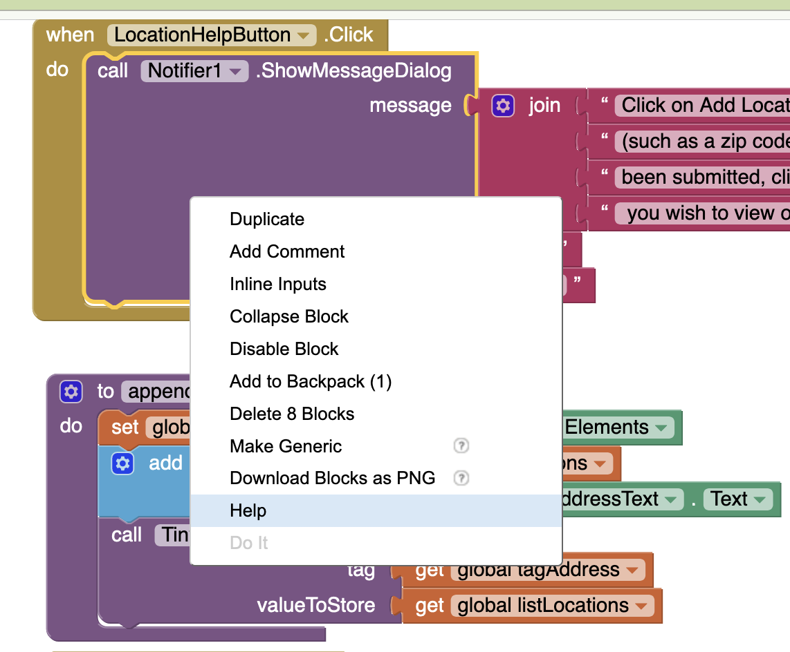

# WEEK 4 (WEEK OF May 26)
## LECTURE - DEBUGGING & ISSUE TRACKING

> Primary contributor: **[Ashley Blacquiere](https://ca.linkedin.com/in/ashley-blacquiere)**
>
> Modified by: Dibya Prokash Sarkar

---

## 1. THE INEVITABILITY OF BUGS
 
Read this carefully:
 
> *"It compiled. It ran. The tests passed.* ***Therefore it must be correct.***"
 
If you've ever caught yourself thinking like that, you're in good company — every developer has. And every developer has been wrong about it.
 
Bugs, [issues](https://en.wikipedia.org/wiki/Software_project_management#Issue), mistaken [assumptions](https://en.wikipedia.org/wiki/Tacit_assumption), and [unintended consequences](https://en.wikipedia.org/wiki/Unintended_consequences) are an *inevitability* of writing code. There's a popular [genre of memes](https://duckduckgo.com/?q=programmer+debugging+meme&iax=images&ia=images) about programmers staring in disbelief at code that "should work" or, worse, code that "works but shouldn't." Those memes resonate because they capture something true: most of us hold an unconscious faith in our own correctness that the code, eventually, betrays.
 
The right starting position is the opposite:
 
> **Bugs are going to happen. The skill isn't preventing them — it's responding well when they do.**
 
That's what Week 4 is about. Two halves: how to *find* a bug efficiently (debugging), and what to do with it once you've found one (bug tracking).
 
---

## 2. THE DEBUGGING MINDSET
 
Before tools, mindset.
 
The most common reason a bug stays alive for hours is that the developer **trusts their own mental model** of what the code does. They read the function, they understand it, they know what it should do — so when the output is wrong, they look anywhere except the code itself.
 
The professional debugger does the opposite:
 
> **The bug is real. My assumption is wrong. Where exactly does the code diverge from what I think it does?**
 
This is a small but profound shift. You stop arguing with the evidence and start *gathering* evidence. The computer is honest. It is running *exactly* the code you wrote. The discrepancy is in your understanding, not in the machine.
 
Three principles flow from that mindset:

### Principle 1 — Reproduce before you fix
 
A bug you can't reproduce reliably is a bug you can't verify you've fixed. Spend the time to find the **shortest sequence of steps** that reliably triggers the bug. This is your *reproduction recipe*. Write it down. Without it, you're guessing.
 
### Principle 2 — Isolate before you fix
 
Don't go straight to the suspected line. **Narrow the search space.** Is the bug in the front-end or the back-end? In the function or in its caller? In the input data or the processing? Each step roughly halves the search space.
 
### Principle 3 — Verify before you celebrate
 
A "fix" that makes the symptom go away but doesn't address the cause is a **trap**. Test the exact reproduction recipe. Then test adjacent cases. Then ask: *did I just hide the bug, or actually fix it?*
 
---
 
## 3. THE DEBUG LOOP
 
Most debugging sessions follow the same four-step loop:
 
```
┌─────────────────────────────────────────────────────────┐
│   REPRODUCE  →  ISOLATE  →  FIX  →  VERIFY  →  (loop)   │
└─────────────────────────────────────────────────────────┘
```

### Step 1 — Reproduce
 
- Get the bug to happen consistently.
- Write down the exact steps. ("Click Submit with empty email field → crash.")
- If you can write a failing **test** that reproduces it, even better. Now you have an automated check that will tell you when the bug is fixed.
### Step 2 — Isolate
 
This is where 90% of debugging time goes. Some techniques:
 
- **Binary search.** Comment out half the code. Does the bug still happen? Now you know which half.
- **Print debugging.** Add `console.log()` (or `print()`, `System.out.println()`, etc.) at suspected points. Crude but fast.
- **Proper debugger.** Set a breakpoint, walk through line by line, watch variables change. This is where the real power lives.
- **Rubber-duck debugging.** Explain the code, line by line, out loud to an inanimate object (or to a confused friend). You'll often find the bug in the act of explaining.
### Step 3 — Fix
 
Once you can pinpoint **the exact line** where reality diverges from your model, the fix is usually obvious. The trap is fixing too much — making *other* changes "while you're in there." Don't. Make the minimum change. Refactor later, separately.
 
### Step 4 — Verify
 
- Run the reproduction recipe. Does the bug still happen? No? Good.
- Run the existing tests. Did you break something else? No? Good.
- Add a test that covers this bug specifically. Now you're future-proofed.
---

## 4. PRINT DEBUGGING vs THE DEBUGGER
 
Many beginners spend their entire career sprinkling `console.log()` statements through their code. It works. It's also slow.
 
Modern debuggers give you everything print statements do — *and* much more, *without* modifying the code:
 
| Capability | Print debugging | Debugger |
|---|---|---|
| See a variable's value at a point | ✓ | ✓ |
| Step through code line by line | — | ✓ |
| Inspect any variable at any point | — | ✓ |
| Pause only when a condition is true | — | ✓ (conditional breakpoint) |
| See the call stack | — | ✓ |
| Modify a variable mid-execution | — | ✓ |
| Doesn't require code changes | — | ✓ |
| Works in production code | Sometimes | ✓ (in dev mode) |
 
**Print debugging is still useful** for quick checks and for code that's hard to attach a debugger to. But if you've never used your IDE's debugger, you're working with one hand tied behind your back.
 
---

## 5. THE DEBUGGER — TOOLS YOU MUST KNOW
 
Every major IDE (VS Code, JetBrains, Visual Studio) exposes the same core set of tools. Learn the names; the shortcuts vary by tool.
 
### 5.1 — Breakpoints
 
A **breakpoint** tells the debugger: *"When execution reaches this line, pause everything."* You set one by clicking the gutter to the left of a line number (the red dot).
 
When the program hits the breakpoint, it pauses. You can then:
- Inspect every variable in scope.
- Look at the call stack (how did we get here?).
- Resume execution, or step line-by-line.
### 5.2 — Conditional breakpoints
 
A breakpoint that *only* pauses if a condition is true. Right-click the breakpoint and add an expression like `user.id === 42` or `i > 100`.
 
This is **enormously powerful** for loops:
 
```javascript
for (const user of users) {
  processUser(user);   // <-- conditional breakpoint: user.id === 42
}
```
 
Without this, you'd hit "continue" 41 times to debug user #42. With it, you skip straight to the interesting case.
 
### 5.3 — Logpoints
 
A breakpoint that doesn't pause execution — it just prints a message. Equivalent to inserting a `console.log()` *without modifying the code*. Useful when you need to trace something through a loop without stopping.
 
### 5.4 — Watches
 
A list of expressions whose values you want to see updated in real time as you step through. Add `user.email`, `cart.total`, `isPriorityCustomer` as watches — they re-evaluate at every step.
 
### 5.5 — Call stack
 
The list of function calls that led to where you are now. Read top-to-bottom: the top is where you are; below it is who called this function; below that is who called *that*. Essential for understanding "how did we end up here?"
 
### 5.6 — Step navigation
 
Three commands that move execution forward:
 
- **Step Over** (F10 in VS Code): execute the current line. If it's a function call, run the whole function and move past it.
- **Step Into** (F11): execute the current line. If it's a function call, *enter* that function and pause on its first line.
- **Step Out** (Shift+F11): run to the end of the current function and pause at the line that called it.
Most beginners only use Step Over. Learning when to use Step Into vs Step Out is what makes debugging *fast*.
 
---

## 6. BROWSER DEVTOOLS — DEBUGGING IN THE WILD
 
For web applications, the debugger lives **in the browser**, not the IDE. Both Chrome and Firefox ship with extremely capable DevTools.
 
### Chrome DevTools (F12 to open)
 
- **Sources tab** — the debugger. Set breakpoints by clicking line numbers. All of the IDE tools (watches, call stack, step controls) are here.
- **Console tab** — REPL where you can run any JavaScript. While paused at a breakpoint, you can type any expression and see its value.
- **Network tab** — see every HTTP request, response, timing, headers, body. Indispensable for API bugs.
- **Elements tab** — inspect the live DOM and CSS. Edit them on the fly to test fixes.
- **Application tab** — view localStorage, sessionStorage, cookies, IndexedDB.
### Firefox DevTools
 
Functionally similar to Chrome. The **Debugger** panel is slightly different but the core concepts are identical.
 
> **Practical tip:** When debugging a web app, *use the browser*. Don't try to debug in your IDE if the bug only appears in the browser context. The browser's tools are purpose-built for the platform.
 
---
 
## 7. AI-ASSISTED DEBUGGING
 
A new tool in the debugging toolkit in 2026: large language models.
 
Claude, ChatGPT, and Copilot are **surprisingly good** at certain debugging tasks and **surprisingly bad** at others. Knowing the difference saves hours.
 
### Where AI helps
 
- **Reading stack traces you don't understand.** "Here's the error. What's it saying?"
- **Identifying obvious bug patterns.** Off-by-one errors, missing `await`, swapped function arguments, null-reference bugs.
- **Suggesting test cases** for a function you're trying to characterize.
- **Explaining unfamiliar error messages** from libraries or frameworks.
- **Rubber-ducking.** Pasting code and asking "what could go wrong here?" often produces a useful checklist.
### Where AI misleads
 
- **Confabulating fixes** for bugs whose root cause is in code the AI can't see (other files, configuration, environment).
- **Hallucinating APIs** that don't exist. ("Use `Array.prototype.flatten()`" — that's not a thing.)
- **Hiding the symptom rather than fixing the cause.** AI will often suggest a `try/catch` that swallows the error.
- **Confident-sounding answers about flaky bugs** (race conditions, timing-dependent bugs, environment-specific bugs).
### The discipline
 
A useful prompt pattern:
 
> "Here's a function and the error I'm seeing. Don't fix it. **Tell me three possible causes**, ranked from most to least likely, and what I should check for each."
 
This shifts the AI from "give me the answer" to "give me a debugging plan." The plan is much more useful — and you stay in the driver's seat.
 
> **The rule:** AI suggestions are *hypotheses*, not *fixes*. Test every one against the actual code.
 
---

## 8. BUG TRACKING — WHY IT MATTERS
 
You found a bug. Now what?
 
The two tempting answers — *"drop everything and fix it"* and *"I'll remember it"* — are both usually wrong.
 
- **"I'll remember it"** ignores how memory works. You won't. The bug will be quietly forgotten and resurface in production.
- **"Drop everything and fix it"** ignores how teams work. You're in the middle of something. Bug priority depends on context you may not have alone. Mid-task fixes muddy commits and make code review harder.
The professional answer: **write it down in a bug tracker.** Then decide *when* to fix it based on its priority relative to everything else.
 
---
 
## 9. ANATOMY OF A GOOD BUG REPORT
 
A bug report is documentation written for a future reader — often a future *you* — who has no memory of the incident. It must stand on its own.
 
The non-negotiable parts:
 
### Title
 
A single sentence that names the bug. Searchable.
 
**Bad:** "It's broken"
**Bad:** "Form doesn't work"
**Good:** "Login form rejects email addresses containing a + character"
 
### Steps to reproduce
 
A numbered list of actions. Any developer (including future-you) should be able to trigger the bug by following them.
 
```
1. Go to /signup
2. Enter email "test+demo@example.com"
3. Enter any password
4. Click "Sign up"
```
 
### Expected behaviour
 
What the user — or the developer — expected to happen.
 
> Account should be created successfully.
 
### Actual behaviour
 
What actually happened. Include error messages, screenshots, stack traces if relevant.
 
> Form shows "Invalid email format" and does not submit. No request appears in the Network tab.
 
### Environment
 
Anything that might matter:
 
- OS / version
- Browser / version
- App version or commit hash
- User role (admin, regular user, etc.)
- Anything unusual about the data
### (Optional but valuable)
 
- **Workaround** if one exists
- **Severity** (see next section)
- **Suggested fix** if you have a hypothesis
---

## 10. SEVERITY vs PRIORITY
 
Two words that sound similar and mean very different things. Many bug-tracker disagreements come from confusing them.
 
| | **Severity** | **Priority** |
|---|---|---|
| **What it measures** | How *bad* the bug is when it happens | How *urgently* it must be fixed |
| **Decided by** | The developer / QA | The product owner / team |
| **Example** | A crash is high severity | Fix the crash *now* vs *next sprint* |
 
A bug can be **high severity, low priority**: a crash that only triggers when a user manually edits a config file no one ever touches.
 
A bug can be **low severity, high priority**: a typo on the company's homepage. Not "bad" in any technical sense — but visible, embarrassing, must-fix-today.
 
### A 2×2 to think with
 
```
                    HIGH severity         LOW severity
                  ┌──────────────────┬──────────────────┐
   HIGH priority  │  Drop everything │  Fix this sprint │
                  ├──────────────────┼──────────────────┤
    LOW priority  │  Track, schedule │  Backlog         │
                  └──────────────────┴──────────────────┘
```
 
Most bugs in real codebases end up in the bottom-right corner. Knowing that is liberating: not every bug must be fixed today.
 
---

## 11. GITHUB ISSUES — THE PRACTICAL WORKFLOW
 
For your DGL 104 work, we'll use **GitHub Issues** as our bug tracker. It's free, integrated with your code, and the conventions you learn here apply to nearly every modern tracker (Jira, Linear, Asana, etc.).
 
### Creating an issue
 
Each repository has an **Issues** tab. Click *New issue*. Use a template if the project provides one; otherwise follow the structure from Section 9.
 
### Labels
 
Categorize the issue:
- `bug` / `feature` / `documentation` / `question`
- `priority: high` / `priority: medium` / `priority: low`
- `good first issue` (a deliberate signal for new contributors)
- Component labels: `frontend`, `database`, `auth`
### Milestones
 
Group issues that should ship together. ("v1.0 release", "End-of-term submission".)
 
### Assignees
 
Who's responsible for this one? Even on a solo project, assign yourself — it signals "I'm working on it" to your future self looking at the issue list.
 
### Linking commits and PRs
 
Mention `Fixes #42` in a commit message or PR description. GitHub automatically closes the issue when the commit merges to the default branch. This creates a **traceable history**: every bug ever found, with the exact code change that fixed it, forever.
 
> **Practical tip:** Even for solo projects, file issues for bugs *as you find them*. Future-you will thank present-you.
 
---

## 12. CONNECTING BACK TO WEEKS 1–3
 
| Week | Topic | How it connects to debugging |
|---|---|---|
| Week 1 | Platforms | Many bugs are *platform-specific*. The same code "works" on Chrome but fails on Safari. |
| Week 2 | Documentation & review | Good naming + clear docs make bugs more *visible* during review, before they ship |
| Week 3 | Refactoring | Refactored code is *easier to debug* — smaller functions, named constants, fewer hiding spots |
| **Week 4** | **Debugging & bug tracking** | **Closing the loop: finding what slipped through, recording it for next time** |
 
These four weeks form a **complete software-craftsmanship loop**:
 
```
Build (Week 1)
   ↓
Document & review (Week 2)
   ↓
Refactor (Week 3)
   ↓
Debug & track (Week 4)
   ↓
   (back to Build)
```
 
This is how professional software development *actually works* — and how your final term project will be assessed.
 
---

## ACTIVITIES
 
> **First class note:** Required activities should be completed before next week.
 
### [REQUIRED] DEBUG "GET THE GOLD"
 
[Get the Gold](http://appinventor.mit.edu/explore/ai2/get-gold) is an MIT App Inventor (AI2) game where the user must capture moving gold medallions by flinging a pirate ship sprite. We're working with a [modified version](https://github.com/nic-dgl104-winter-2025/guide-get-the-gold-debugging) that includes some additional features — and a handful of deliberate bugs.
 
**Your task:**
 
1. Clone the repository.
2. Import the buggy `.aia` into AI2.
3. Run the app. Identify the bugs by playing.
4. For each bug you find, **file a GitHub Issue** on your fork with:
   - A descriptive title
   - Steps to reproduce
   - Expected vs actual behaviour
   - Severity (high / medium / low)
5. Fix at least **three** of the bugs you filed. Each fix should be a separate commit. Reference the issue number in the commit message (`Fixes #1`).
**Keep AI2 documentation open** while you work:
- [Blocks reference](http://ai2.appinventor.mit.edu/reference/blocks/)
- [Component reference](http://ai2.appinventor.mit.edu/reference/components/)
> Right-click any block or component and choose **Help** for inline documentation.
 

 
### [REQUIRED] READ THE BRIGHTSPACE RUBRICS CAREFULLY
 
Rubrics for both the Programming Practice article and the AI2 project are on Brightspace. **Read them.** They're the criteria I'll grade your work against.
 
> If something in a rubric is unclear, **say so**. Fixing an unclear rubric before grading helps everyone — including me.
 
### [REQUIRED] BUILD AN MVP OF YOUR AI2 PROJECT
 
Two weeks remain until your AI2 project is due. Now is the time to have a **[minimum viable product](https://en.wikipedia.org/wiki/Minimum_viable_product)** running.
 
An MVP doesn't have to be polished. It has to **work end-to-end** for the core use case. Better to have one feature working completely than five features half-built.
 
Once your MVP runs:
1. Install it on a device.
2. Hand it to a friend. Don't explain anything.
3. Watch them use it. Note what they touch first, what confuses them, what they expect to happen.
4. Write down what they say *and* what they don't say.
User testing — even informal — uncovers things you can't see from inside your own head.
 
### [RECOMMENDED] DRAFT YOUR PROGRAMMING PRACTICE ARTICLE
 
If you have an outline, write a first draft. It can be:
 
- **Short:** topic sentences only, with TODO markers for code examples
- **Long:** write past the target length, then cut
Whichever approach fits your style, getting ideas on paper now is enormously valuable for the next two weeks. NIC Library's [writing support](https://library.nic.bc.ca/writingsupport) is excellent if you want feedback.
 
### [RECOMMENDED] FOLLOW-UP QUESTIONS AND REFLECTIONS
 
1. Open the debugger in your preferred IDE. List every feature in the debug panel. How many were you already familiar with?
2. Recall a past project where a bug was particularly hard to find. What techniques did you use? Which Week 4 techniques would have helped you?
3. Look at the GitHub Issues on a popular open-source project (try [VS Code's repository](https://github.com/microsoft/vscode/issues)). Read three recent issues. Which ones are well-written? What makes them good?
4. The hardest bugs are often the ones where **your mental model is wrong**. When is the last time you had to genuinely change your understanding of how a piece of code worked? What did that feel like?
---
 
## OPTIONAL RESOURCES
 
### Foundational reading
 
- **[MIT 6.005 Debugging notes](https://ocw.mit.edu/ans7870/6/6.005/s16/classes/11-debugging/)** — A precise, academic treatment of debugging principles. Worth bookmarking.
- **[Julia Evans — Debugging zines](https://wizardzines.com/zines/bite-size-debugging/)** — Friendly, illustrated guides to debugging concepts. Genuinely fun.

### Tool-specific
 
- **[Debugging in VS Code](https://code.visualstudio.com/Docs/editor/debugging)** — Comprehensive tour.
- **[Chrome DevTools: JavaScript debugging](https://developer.chrome.com/docs/devtools/javascript/)** — The canonical Chrome reference.
- **[Firefox JavaScript Debugger](https://firefox-source-docs.mozilla.org/devtools-user/debugger/index.html)** — Excellent for cross-browser debugging.
### Bug tracking & process
 
- **[GitHub Issues docs](https://docs.github.com/en/issues)** — How GitHub's tracker actually works.
- **[How to write a good bug report](https://www.atlassian.com/agile/software-development/bug-tracking)** — Atlassian's take. Vendor-y but clear.
### Books
 
- **Andreas Zeller — *Why Programs Fail***. Academic but readable; the deepest treatment of debugging methodology in print.
- **John Robbins — *Debugging Applications***. Older but timeless. The Windows examples date it; the principles don't.
---

# A NOTE ON AI TOOLS
 
Use AI in debugging like a junior pair-programmer — useful, but never the final word:
 
- **Good use:** "Here's the error. Don't fix it — give me three possible causes ranked by likelihood, and tell me what to check for each."
- **Good use:** "Explain this stack trace to me." (Especially for unfamiliar frameworks.)
- **Good use:** "Read this function. What are three ways it could fail?"
- **Less good use:** Pasting a bug and asking "fix this" without context. The AI will guess. The guess may be wrong in confident-sounding ways.
The skill you're building this week is **debugging discipline**. AI can accelerate that discipline. It cannot replace it.
 
---


### DEBUGGING
[Bugs](https://en.wikipedia.org/wiki/Software_bug), [issues](https://en.wikipedia.org/wiki/Software_project_management#Issue), mistaken [assumptions](https://en.wikipedia.org/wiki/Tacit_assumption) and [unintended consequences](https://en.wikipedia.org/wiki/Unintended_consequences) are an inevitability of writing code. As fantastic as it would be to get everything right the first time, it's unlikely. And furthermore, it's probably unhelpful to think that bugs are not going to happen. You might be familiar with the various [programming memes](https://duckduckgo.com/?q=programmer+debugging+meme&t=ffab&iar=images&iax=images&ia=images) out there that reference the programmer's confusion in attempting to understand both non-working _and_ working code. These memes speak in a very real way to the faith most programmers (me included!) tend to have in the foolproof nature of their own code; I've definitely been guilty of saying "no, that would be impossible!" in the face of a result that very clearly indicates the opposite. :)  

 So, instead, I'd like you to recognize that bugs are _going_ to happen and that it's ok when they do. As long as you have a strategy, of course! This week's videos outline foundational strategies you can take when debugging, but it's your job to figure out how to apply them to your own context (i.e. your programming environment of choice). 

Identifying the source of bugs can be tricky, so having a thorough understanding of the development and debugging tools at your disposal is critical. While I can appreciate that it can feel like a lot of work to learn the ins and outs of debugging tools in your IDE of choice, doing so will pay off in the long run. Learn how to use your debugger, and especially those tools that are common to most, like [breakpoints](https://en.wikipedia.org/wiki/Breakpoint), conditional breakpoints, variable watches and navigation. Being comfortable with these tools will, most times, be the difference between a frustrating and unproductive debugging session, and one where a clear path forward is identified. 

<div class="video-container-16by9"><iframe width="560" height="315" src="https://youtube.com/embed/-jzOXtbntvw"></iframe></div>

### BUG TRACKING
Once you find a bug, what do you do with it? Do you drop everything and fix it right away? Do you make a mental note and say you'll come back later? While I'll concede that sometimes these two options might feel like the right direction, it's rarely the case. Much better is to record information about the bug in a bug tracking system that allows you  (or other developers) to correctly [prioritize](https://en.wikipedia.org/wiki/Prioritization) the bug.

Why is prioritization such a key aspect of bug tracking? Well, remember that we want to make small and meaningful commits at every opportunity. Rolling a bug fix into a larger commit is generally a bad idea. But dropping current progress to address a bug without considering the broader development context could be even worse. What if your fix changes the fundamental nature of some aspect of the codebase? Or what if the bug really isn't that big an issue, and can be deprioritized to be dealt with later? Focusing on low-priority bugs (especially those with complex fixes) reduces the amount of capacity you have to work on bugs that might make a major difference to your user-base. 

Well-documented and tracked bugs are bugs that can effectively be squashed. Don't neglect setting up a bug tracking process - even if you are a solo developer!

<div class="video-container-16by9"><iframe width="560" height="315" src="https://youtube.com/embed/mbk4WLZj4yg"></iframe></div>

## ACTIVITIES

### [REQUIRED] DEBUG GET THE GOLD
[Get the Gold](http://appinventor.mit.edu/explore/ai2/get-gold) is a [really not very fun...] `AI2` "game" that where the user is required to capture all the gold medallions on the screen by flinging a pirate ship sprite toward them. Of course, the gold medallions move based on a clock timer, so there is some "challenge". The version of [Get the Gold](https://github.com/nic-dgl104-winter-2025/guide-get-the-gold-debugging) we'll look at is modified from the tutorial and includes some additional features (both UI and gameplay). It also includes bugs. 

Your task is to identify the bugs and fix them. Some of these bugs will be fairly obvious and some of which will be harder to find. If you haven't seen it yet, I'll also suggest that you might find value in keeping a browser tab with the [`AI2` documentation](http://appinventor.mit.edu/explore/library) open (especially both the [blocks reference](http://ai2.appinventor.mit.edu/reference/blocks/) and the [component reference](http://ai2.appinventor.mit.edu/reference/components/)), so that you can reference what components are _supposed_ to do. You can also access documentation on specific blocks and components by right clicking and choosing "Help" from the context menu:



This activity probably works best in pairs, or in small groups, if you can find a partner or two to work with.

### [REQUIRED] READ BRIGHTSPACE RUBRICS CAREFULLY
Rubrics for both the Programming Practice article and the `AI2` project have been posted to Brightspace. In addition to the requirements already posted, the rubrics are how I will be evaluating your work. If you want to do well, it makes sense that you take a careful read of the rubrics to ensure you understand the project requirements in full.

Once you have read through the rubrics I would like you to post either a comment that demonstrates your understanding of the rubrics, or a question that will help you (and perhaps others) better understand the rubrics. It's important to note that despite my best efforts, there could be elements of the rubrics that are unclear. If everyone reads them carefully then we can hopefully fix any potential errors / misunderstandings before projects are submitted to be graded. This helps everyone - me included!

### [RECOMMENDED] WRITE A DRAFT OF YOUR PROGRAMMING PRACTICE ARTICLE
If you've taken the time to write a good outline, then you are already in a good position to write a draft of your article. For this first draft, concentrate on writing topic sentences that introduce each point you want to make in each paragraph, then use these to identify where code snippets and examples are going to be the most valuable to your article. 

Or feel free to take an alternative approach. Your draft can take many forms: It could be shorter than the final article, identifying only the critical statements that you can build on in second draft (my suggestion above); or, if you find writing easy, it could be much _longer_ than the target length of your article, and your work over the next week might involve cutting it down to a more manageable length. Whatever you do, getting some ideas down on paper will be a huge help to you over the next two weeks. 

If you need help with this you can reach out to me, or ask on Slack. The NIC Library also provides many [excellent resources](https://library.nic.bc.ca/writingsupport) to support your writing activities.

### [REQUIRED] BUILD AN MVP OF YOUR `AI2` PROJECT
With two weeks remaining, and given that you've built up some `AI2` experience, now would be a good time to put together a [minimum viable product](https://en.wikipedia.org/wiki/Minimum_viable_product) for your intended `AI2` project.

Once you have an MVP in-hand, the next best step is to test it out with a friend. If possible, build your MVP, install it on your device and share it with anyone and everyone you can. The more eyes and reactions you get on your MVP, the better your final product will be. Keep notes of what your testers have to say - and what they don't say! You can learn just as much from watching reactions as you can from listening to feedback.

### [RECOMMENDED] FOLLOW-UP QUESTIONS AND REFLECTIONS
1. Examine debugging tools in a preferred IDE or code editor of choice. What features are supported? Take a careful look through the debugger UI and identify available features. 
2. How many of the debugging features available are you already familiar with? Create a table that compares and contrasts your familiarity, or lack of familiarity, with the available features. 
3. When has debugging been particularly challenging? Consider a project that you've worked on in the past where a bug was particularly difficult to solve. What techniques did you use? How has what you've recently learned going to help you debugging similar issues the future? 


## OPTIONAL CONTENT
- [MIT 6.005 Debugging](https://ocw.mit.edu/ans7870/6/6.005/s16/classes/11-debugging/)
- [Debugging in VS Code](https://code.visualstudio.com/Docs/editor/debugging)
- [Debug JavaScript in Chrome](https://developer.chrome.com/docs/devtools/javascript/)
- [Firefox JavaScript Debugger](https://firefox-source-docs.mozilla.org/devtools-user/debugger/index.html)
